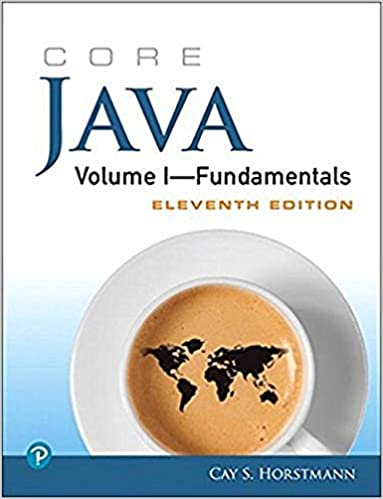

# Syllabus - CS 3230 Object Oriented User Interface #

## Contents ##

- [Syllabus - CS 3230 Object Oriented User Interface](#syllabus---cs-3230-object-oriented-user-interface)
  - [Contents](#contents)
  - [Instructor](#instructor)
  - [Course Objectives](#course-objectives)
  - [Book](#book)
  - [Software](#software)
  - [Students With Disabilities](#students-with-disabilities)
  - [Course Fee](#course-fee)
  - [Class Format](#class-format)
  - [Keys to Success](#keys-to-success)
  - [Assignments](#assignments)
  - [Asking Questions](#asking-questions)
  - [Grading](#grading)
  - [CS Academic Cheating Policy](#cs-academic-cheating-policy)
  - [Extra Credit](#extra-credit)
  - [Schedule](#schedule)

## Instructor ##

My name is Ethan Brown. I'm a Weber State Alumni and a Software Engineer at local startup called TaxBit. I have experience working for big companies like Adobe and 3M as well. You can connect with me on linkedIn at [linkedin.com/in/ethan-brown-dev](https://www.linkedin.com/in/ethan-brown-dev/).

I mostly work with python and bash in my day-to-day work. This just means I will need you all to call me out as I miss those semi-colons and curly braces during demos. I've learned in my career the importance of knowing universal problem sovling and engineering skills over just learning the nuances of a language. Anyone can memorize syntax, engineers solve problems.

## Course Objectives ##

This is the official course description.

> An intermediate programming course that covers the “core” features of the Java programming language with the goal of preparing students to focus on specialized uses of Java. Topics include object-oriented programming and polymorphism, graphics, event handling, building graphical user interfaces with Swing, multithreading and synchronization, and error handling. Prerequisite: CS 2420.

My goal of this course will be for you to become better ENGINEERS. Not just be able to recite facts and code snippets.

## Book ##

The book is **optional** but it might be a useful reference. I will be using it to prepare
classroom lectures but there will no assignments directly out of the book.

* Core Java Volume 1 (Latest edition is 11 but anything published in the past few years is fine)

## Software ##

We will be using Java 11 and git. I recommend you use the Amazon Corretto distribution of Java.
We will cover how to download it as well as git in class.

* IntelliJ Community Edition (As students you have access to the enterprise edition for free but it's not necessary)
* VS Code or another source-code editor
* git - you will need a github account as well

## Students With Disabilities ##

Any student requiring accommodations or services due to a disability must contact Services for
Students with Disabilities (SSD) in room 181 of the Student Services Center. SSD can also
arrange to provide course materials (including this syllabus) in alternative formats if necessary.

## Course Fee ##

Course fees for the Computer Science major are designed to cover the costs of lab equipment
maintenance and replacement including desktop and server computer systems and software;
consumable materials and supplies; and support for lab aides, student tutors, and online
instructional resources.

## Class Format ##

The class will consist of homework assignments, in-class activities and a final project. With the COVID-19 orders for no public gatherings we will be having virtual classes using Zoom. Attendance in these classes will be vital for your success in the class for several reasons:
  * In-class exercises/activities that will count towards your grade
  * I will go over homework assignment instructions in class
  * If you are struggling with keeping up on the homework assignments but you are coming to class it doesn't allow me any time to help you

## Keys to Success ##

1. 100% attendance
2. If you must miss class let me know so we can work out anything you need to make up
3. Ask questions during class
4. Check the canvas announcements
5. Post any questions outside of class on the canvas discussion board
6. Turn in every assignment

## Assignments ##

The course will be broken up into 2 parts. The first part will consist of smaller
assignments that will be focused on learning general concepts of JAVA and programming paradigms.
The second part will be focused on a final group project.

* Assignments will be given with plenty of time to complete
* I will allow time in class to work
* They will require time outside of class especially as they increase in scope and difficulty
* Late assignments will incur a 10% penalty
* Anything turned in over a week late will incur a 50% penalty
* If you are struggling to keep up talk to me ASAP. Don't wait until the assignment is due.
* You will use git to turn your code
* If you don't know git, don't panic! We will discuss how to use git in class and I will show you what you need know

## Asking Questions ##

Don't hesitate to ask questions. In this industry you have to be inquisitive, no matter how
"stupid" you think it is. The only thing that is stupid is making assumptions. Always clarify
and ask. There are 3 resources for asking questions.

1. In Class
2. Canvas Discussion Boards
3. direct email to me (only use this if it is a personal matter or urgent)

## Grading ##

    A = 93 - 100%
    A- = 90 - 92.99%
    B+ = 87 – 89.99%
    B = 83 – 86.99%
    B- = 80 – 82.99%
    C+ = 77 – 79.99%
    C = 73 – 76.99%
    C- = 70 – 72.99%
    D+ = 67 – 69.99%
    D = 63 – 66.99%
    D- = 60 – 62.99%
    E  = below 60%

## CS Academic Cheating Policy ##

CS policy dictates that any verifiable evidence of student academic cheating, as defined and determined by the instructor, will result in: 
1) an automatic failing grade for the class and 
2) a report to the Dean of Students that will include the student's name and a description of the student's dishonest conduct.

## Extra Credit ##

There will be opportunities for some extra credit. They involve helping me refine the course material. In order to keep materials fresh with minimal errors I will allow you to submit pull requests against it. I will explain how that works as we dive into using Git.

## Schedule ##

The Schedule is a ***tentative*** outline of what we will cover. I reserve the right to adjust the schedule to better meet
the class needs. My goal would be to finish up the topics earlier to allow more time for
the final project. I will be your guide through this and we will speed up and slow down as
needed.

| Week | Days                    | Material                                             |
| ---- | ----------------------- | :--------------------------------------------------- |
| 1    | May 5th, 7th            | Course Introduction and Install Software |
| 2    | May 12th, 14th          | Developer Productivity: Command Line and git |
| 3    | May 19th, 21st          | Java Basics Review - Expressions, Statements, Blocks, etc. |
| 4    | May 26th, 28th          | Methods and Control Flow Statements |
| 5    | Jun 2nd, 4th            | Classes and Objects |
| 6    | Jun 9th, 11th           | Object Oriented Design: Inheritance and Polymorphism |
| 7    | Jun 16th, 18th          | Arrays, Generics and Collections |
| 8    | Jun 23rd, 25th          | Inner and Abstract Classes, Interfaces, Lambda Expressions |
| 9    | Jun 30th, July 2nd      | Exception Handling |
| 10   | Jun 7th, 9th            | GUI Concepts |
| 11   | Jul 14th, 16th          | Network Programming |
| 12   | Jul 21st, 23rd          | Concurrency |
| 13   | Jul 28th, 30th          | REST APIs and HTTP |
| 14   | Aug 4th, 6th            | Final Project |
| 15   | Aug 11th, 13th          | Final Project Due the 13th by midnight |
